# ⌨️👐⌨️  Corne View ZMK Configuration

[ZMK](https://github.com/zmkfirmware/zmk) firmware configuration for a [Corne keyboard](https://github.com/foostan/crkbd).

This configuration uses the [Graphite](https://github.com/rdavison/graphite-layout) layout with [home row mods](https://precondition.github.io/home-row-mods). 

## Layout



> Generated with [Keymap Drawer](https://github.com/caksoylar/keymap-drawer).

## Key Positions

Used as `key-positions` for [combos](https://zmk.dev/docs/keymaps/combos).

```
Left half (21 keys)       Right half (21 keys)
-------------------       -------------------
  0   1   2   3   4   5       6   7   8  9  10  11
 12  13  14  15  16  17      18  19  20 21  22  23
 24  25  26  27  28  29      30  31  32 33  34  35
              36  37  38    39  40  41
```

## Building

The firmware and diagrams are built via GitHub Actions workflow.

To use Keymap Drawer locally, use [draw.zsh](./scripts/draw.zsh).

## Useful links

- [Build guide - typeractive.xyz](https://docs.typeractive.xyz/build-guides/corne-wireless) 
- [Typing lessons - keybr.com](https://www.keybr.com/)
- [Keyboard layouts doc (3rd edition)](https://docs.google.com/document/d/1W0jhfqJI2ueJ2FNseR4YAFpNfsUM-_FlREHbpNGmC2o/edit?usp=sharing)